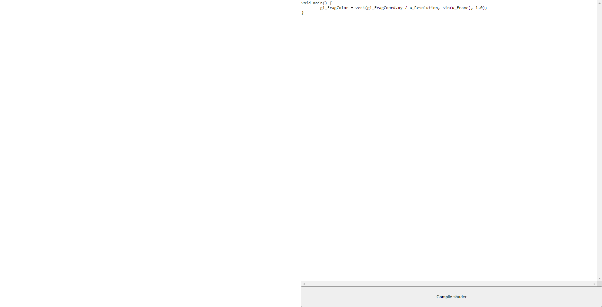
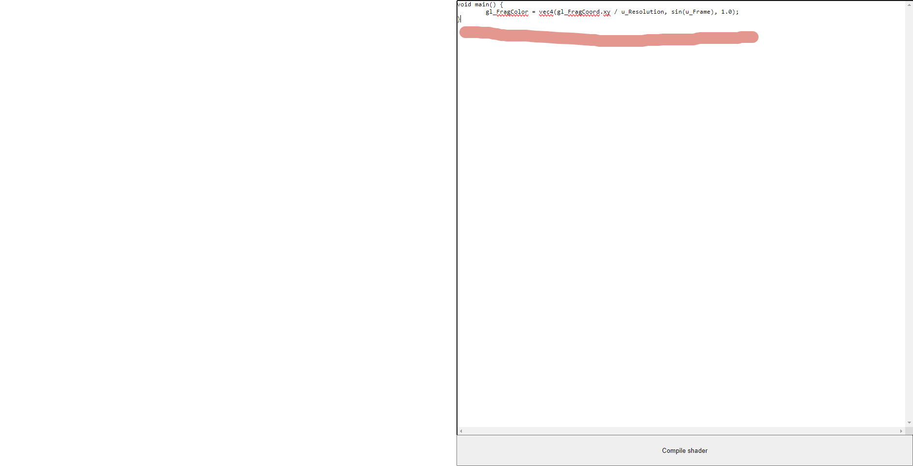

# DAMN8D v0.0.0.0_b1 - Docs

## Summary

DAMN8D (next "Engine") is contains 3 controls:

* Text field
* Button
* Canvas

You can input some shader program to the text field and if you press button you can see rendered data into the canvas.

## Internal variables

In this version, Engine contains 4 internal variables: `u_Frame`, `u_MouseKeys`, `u_MouseMove` and `u_Resolution`

* `u_Frame` returns frame id, which equivalents ms. For better performance multiply this value to `60.0`.\
  Type: `float`
* `u_MouseKeys` returns pressed mouse keys include wheel and right key. It is multiple variable.\
  Type: `vec3`
* `u_MouseMove` returns mouse coordinates. Use for moving objects and scrolling.\
  Type: `vec3`
* `u_Resolution` returns screen Resolution. It's better for computing uv and texture coordinates.\
  Type: `vec2`

## Manual

If you open the Engine, you see this screen

Put your shader program to the text field or leave current program

Press button for compiling shader

And watch result, which rendered in Canvas

Few sconds later

