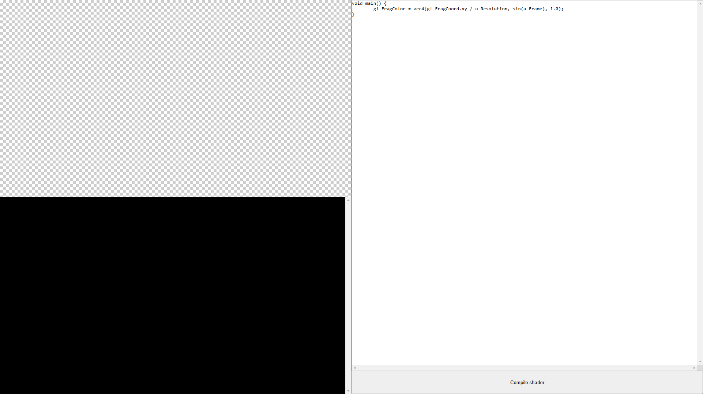
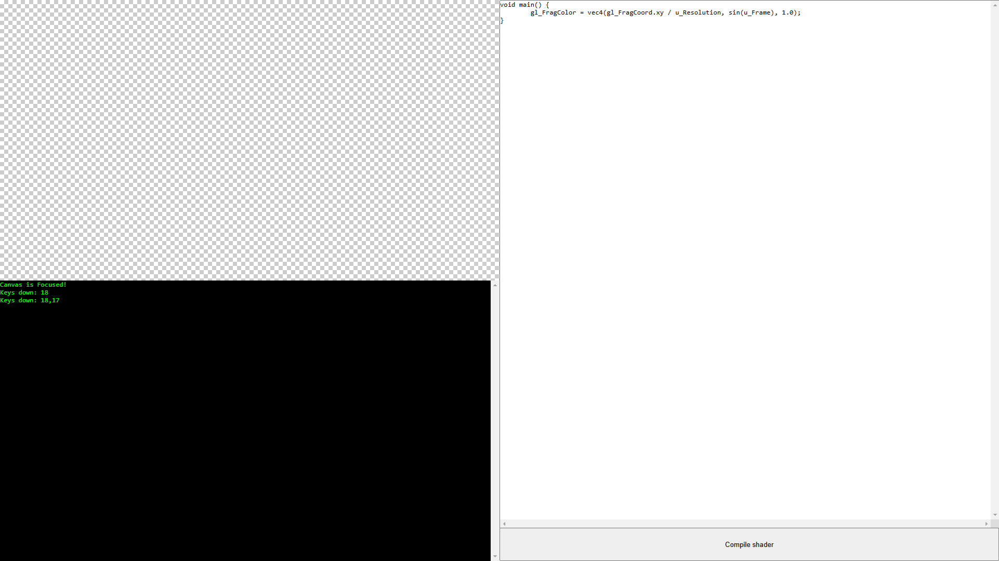
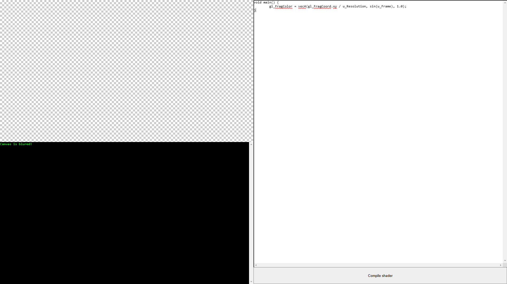
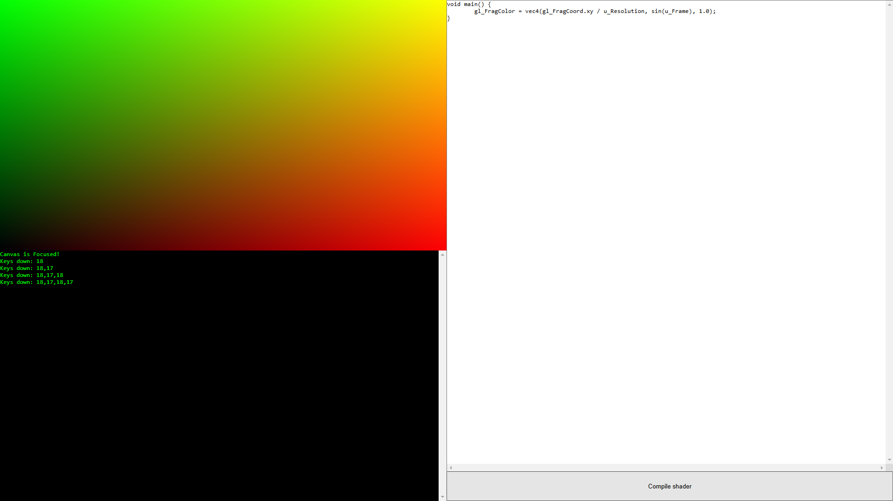
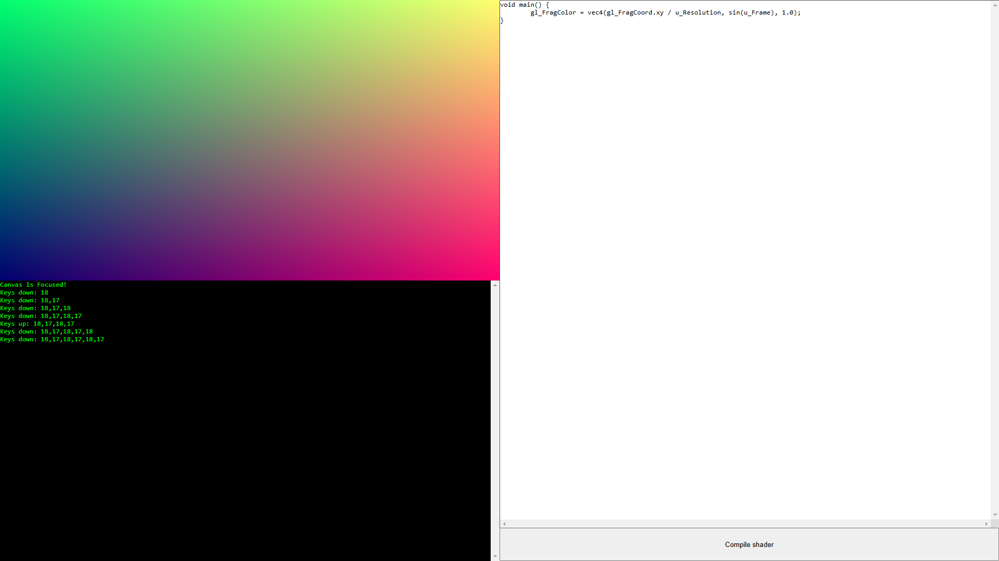
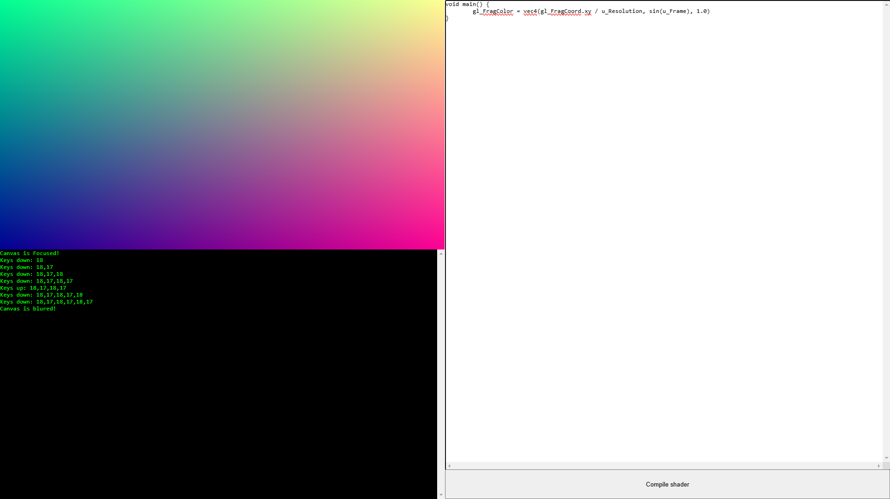
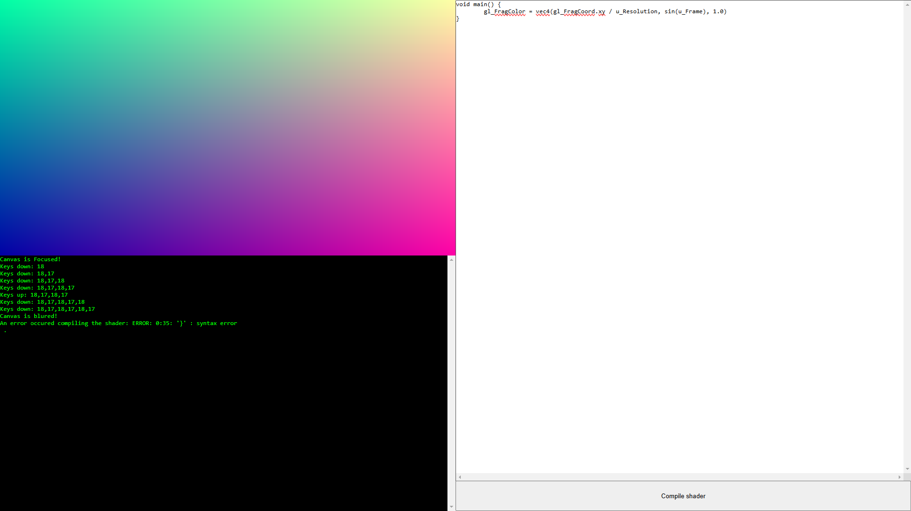
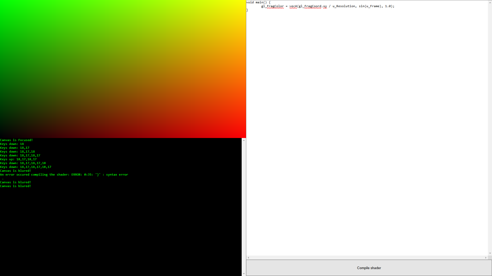

# DAMN8D v0.0.0.2_a - Docs

## Summary

DAMN8D (next "Engine") is contains 4 controls:

* Text field
* Button
* Canvas
* Console

You can input some shader program to the text field and if you press button you can see rendered data into the canvas. Use console for find and fix errors in shader

## Internal variables

In this version, Engine contains 31 internal variables: `u_Frame`, `u_MouseKeys`, `u_MouseMove`, `u_Resolution` and `u_[TextureName]`

* `u_AWSD` returns counters.You can use this values for moving, rotatin, change color etc.\
  Type: `vec2`
* `u_Brick` returns Brick texture.\
  Type: `sampler2D`, but you can use this type as `vec4`
* `u_Checker` returns Checker texture.\
  Type: `sampler2D`, but you can use this type as `vec4`
* `u_Concrete` returns Concrete texture.\
  Type: `sampler2D`, but you can use this type as `vec4`
* `u_Frame` returns frame id, which equivalents ms. For better performance multiply this value to `60.0`.\
  Type: `float`
* `u_Grass` returns Marble texture.\
  Type: `sampler2D`, but you can use this type as `vec4`
* `u_Keys[N]` returns code of pressed key. Inddex `N` is means order of pressed keys. `u_Keys[0]` is `Ctrl` and `u_Keys[3]` is `Alt` for example. `N`-range starts from 0 and ends to 9.\
  Full list of `u_Keys`-variables:
  + `u_Keys[0]`
  + `u_Keys[1]`
  + `u_Keys[2]`
  + `u_Keys[3]`
  + `u_Keys[4]`
  + `u_Keys[5]`
  + `u_Keys[6]`
  + `u_Keys[7]`
  + `u_Keys[8]`
  + `u_Keys[9]`\
  Type: `int`
* `u_LCR` returns mouse keys counter. Use this variable for more controls.\
  + `u_LCR.x` - `MOUUSE_KEY_LEFT` counter
  + `u_LCR.y` - `MOUSE_KEY_CENTER` counter
  + `u_LCR.z` - `MOUSE_KEY_RIGHT` counter
  Type: `vec3`
* `u_Marble` returns Marble texture.\
  Type: `sampler2D`, but you can use this type as `vec4`
* `u_MouseKeys` returns pressed mouse keys include wheel and right key. It is multiple variable.\
  Type: `vec3`
* `u_MouseMove` returns mouse coordinates. Use for moving objects and scrolling.\
  Type: `vec3`
* `u_Resolution` returns screen Resolution. It's better for computing uv and texture coordinates.\
  Type: `vec2`
* `u_Sand` returns Sand texture.\
  Type: `sampler2D`, but you can use this type as `vec4`
* `u_Skin` returns Skin texture.\
  Type: `sampler2D`, but you can use this type as `vec4`
* `u_SkyBox` returns Sky Box texture. It's better than generating sky box programmly if you want add photorealistic sky in your tiny project.\
  Type: `sampler2D`, but you can use this type as `vec4`
* `u_SkyBox2` returns Sky Box 2 texture. It's better than generating sky box programmly if you want add photorealistic sky in your tiny project.\
  Type: `sampler2D`, but you can use this type as `vec4`
* `u_Space` returns Space texture. It's better than generating sky box programmly if you want add photorealistic sky in your tiny project.\
  Type: `sampler2D`, but you can use this type as `vec4`
* `u_Space2` returns Space 2 texture. It's better than generating sky box programmly if you want add photorealistic sky in your tiny project.\
  Type: `sampler2D`, but you can use this type as `vec4`
* `u_Stone` returns Stone texture.\
  Type: `sampler2D`, but you can use this type as `vec4`
* `u_Terrain` returns Terrain texture.\
  Type: `sampler2D`, but you can use this type as `vec4`
* `u_Terrain2` returns Terrain 2 texture.\
  Type: `sampler2D`, but you can use this type as `vec4`
* `u_Terrain3` returns Terrain 3 texture.\
  Type: `sampler2D`, but you can use this type as `vec4`
* `u_Terrain3_NormalMap` returns Terrain 3 Normal map texture.\
  Type: `sampler2D`, but you can use this type as `vec4`
* `u_Terrain4` returns Terrain 4 texture.\
  Type: `sampler2D`, but you can use this type as `vec4`
* `u_Terrain4_NormalMap` returns Terrain 4 Normal map texture.\
  Type: `sampler2D`, but you can use this type as `vec4`
* `u_Wood` returns Stone texture.\
  Type: `sampler2D`, but you can use this type as `vec4`

## Manual

If you want to control your working program, you need just press to canvas and keyboard input will active. If you press to text field, you are activate editor mode.

If you open the Engine, you see this screen

Then, if you press to canvas (checker field), you see the message about canvas focusing. Now you can control your scene with using keyboard

If you press to text field, you see the message about canvas bluring. It's meaning you can continue write your code

If you press to button (Compile shader), your shader will compile and run aftercompiling. With controls and animations

Simple mouse control demo

https://github.com/user-attachments/assets/361f799d-a53d-4861-92d3-da5d69146e5e

3D path tracing example

https://github.com/user-attachments/assets/d34530e9-81eb-4191-adad-ebb9369805f9

If you compile your code with errors, you see message about this in console

Also, in old versions (v0.0.0.0_a - v0.0.0.1_b5) you can see word wrapping in editor. Now you can scroll editor both by X- and Y- sides
